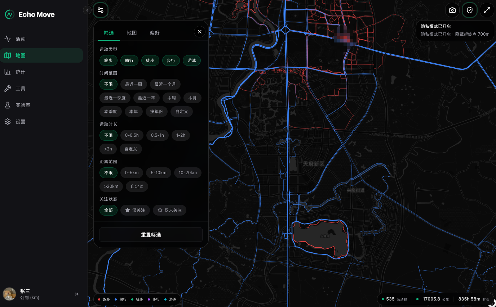
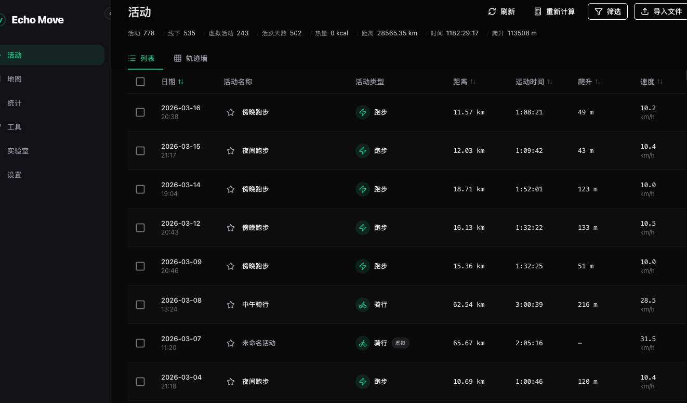
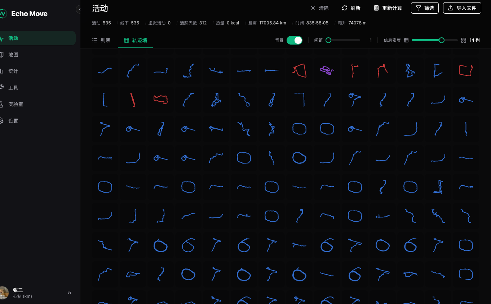
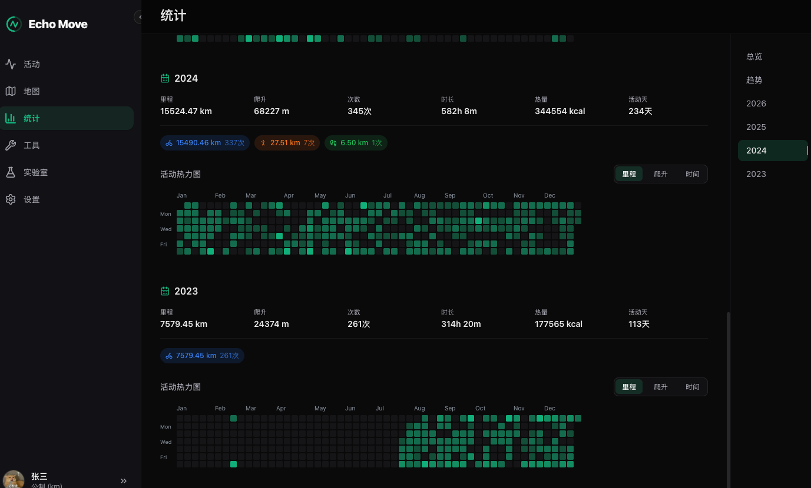
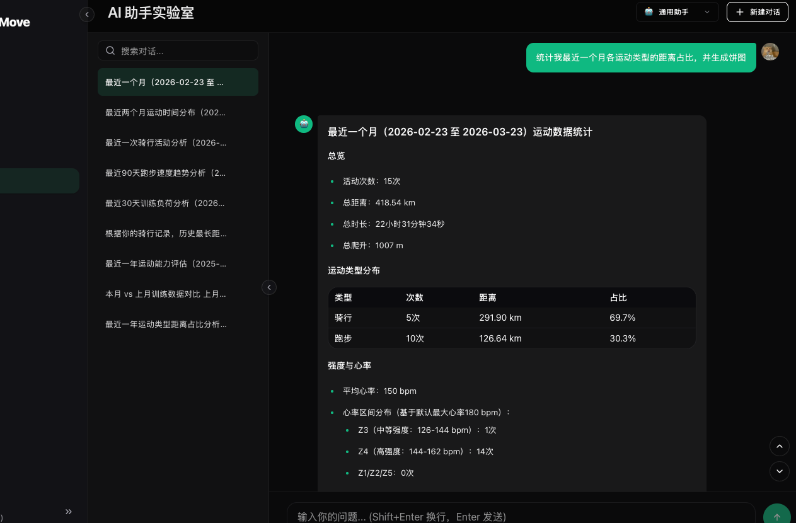
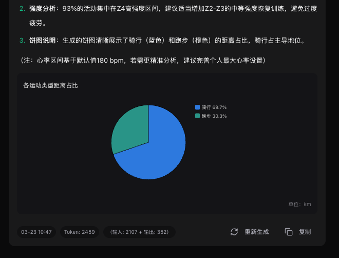

# Echo Move

Echo Move 是一个面向个人运动数据的桌面应用，支持导入、整理、修复、可视化与分析 `FIT` / `GPX` / `TCX` 文件。应用采用 local-first 设计，活动数据默认保存在本地，不依赖账号体系或云端同步。

当前首个公开版本为 `0.0.1`。

## 核心能力

### 活动管理

- 支持文件选择、拖拽和批量导入
- 支持 `FIT`、`GPX`、`TCX` 三类主流运动文件
- 提供列表视图与轨迹墙视图，方便整理和回看
- 支持按关键词、运动类型、时间范围等条件快速筛选
- 支持批量导出、数据修复与轨迹修复
- 兼容不同坐标系统，活动数据默认仅保存在本地

### 地图可视化

- 基于 MapLibre GL 的高性能轨迹渲染
- 支持独立地图筛选、图例、统计卡片和最近活动高亮
- 支持轨迹颜色、线宽、透明度与底图样式切换
- 支持隐私模式、截图导出和海报导出
- 可在大批量活动数据下保持流畅浏览体验

### 统计与 AI Lab

- 提供生涯总览、趋势统计、年度汇总和热力图视图
- 统计页参考 Running-Page，并结合运动回看需求做了本地化调整
- AI Lab 已支持归纳整理统计数据
- AI Lab 已支持根据运动数据直接生成图表

### 工具与存储

- 提供格式转换与数据修复工具
- 支持多用户本地档案、主题、语言和存储管理
- AI 功能需要先在应用设置中配置可用模型提供商

## 截图

### 地图页

### 活动列表

### 轨迹墙

### 统计页

### AI Lab

## 下载

前往 [Releases](https://github.com/havebear/echo-move-release/releases) 页面下载最新版本。

`0.0.1` 当前提供的安装包形态如下：

| 平台 | 文件 |
| --- | --- |
| macOS (Apple Silicon) | `Echo Move-0.0.1-arm64.dmg` |
| macOS (Intel) | `Echo Move-0.0.1-x64.dmg` |
| Windows (64-bit) | `Echo Move-0.0.1-setup.exe` |
| Linux (64-bit) | `Echo Move-0.0.1-x64.AppImage` / `Echo Move-0.0.1-x64.deb` |

## 数据存储

活动、用户和大部分配置默认存储在本地：

- macOS: `~/Library/Application Support/echo-move/`
- Windows: `%APPDATA%/echo-move/`
- Linux: `~/.config/echo-move/`

## 相关链接

- 发布仓库: [havebear/echo-move-release](https://github.com/havebear/echo-move-release)
- 下载页面: [Releases](https://github.com/havebear/echo-move-release/releases)
