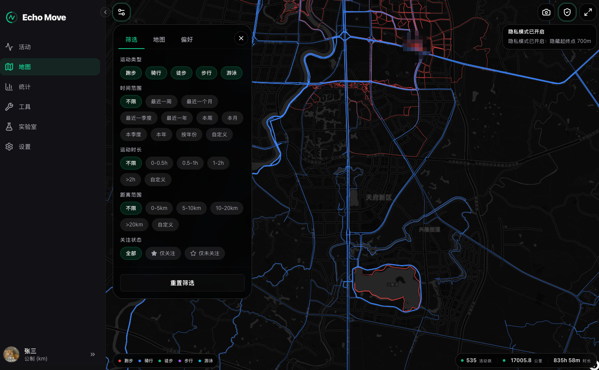
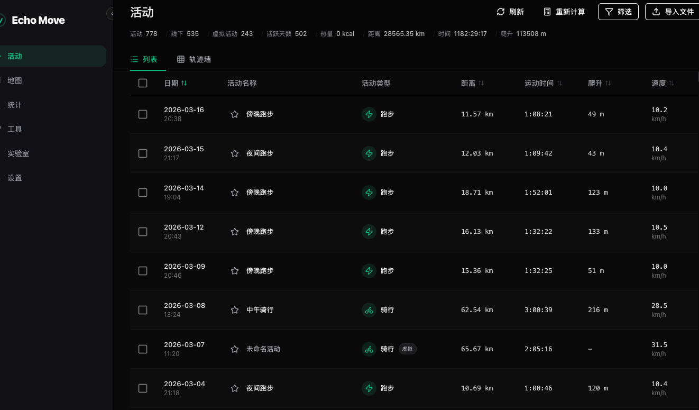
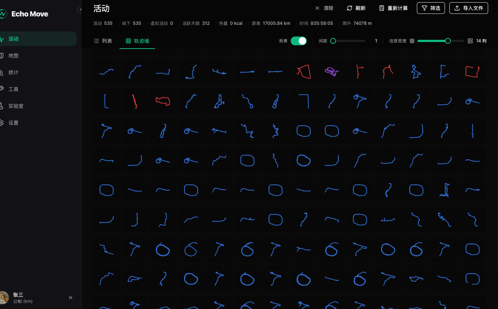
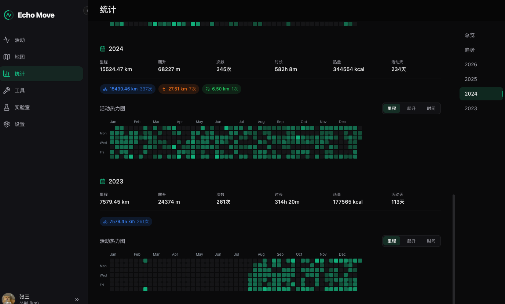
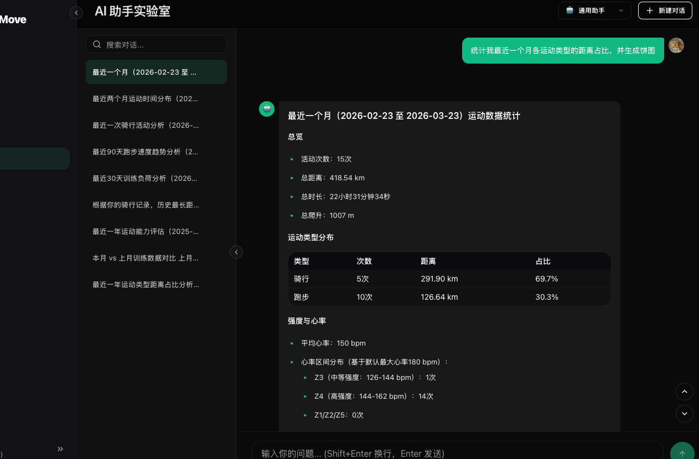
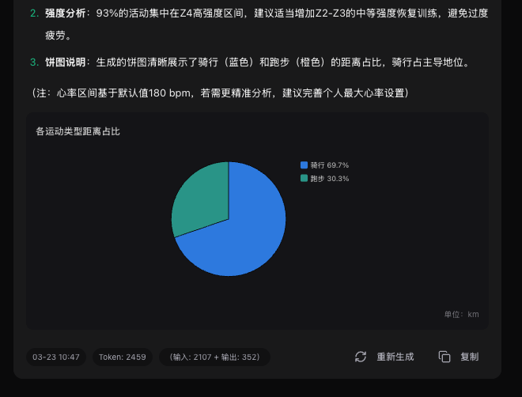

# Echo Move

Echo Move 是一个面向个人运动数据的桌面应用，支持导入、整理、修复、可视化与分析 `FIT` / `GPX` / `TCX` 文件。应用采用 local-first 设计，活动数据默认保存在本地，不依赖账号体系或云端同步。

当前公开版本为 `0.0.20`。

## 0.0.20 版本亮点

- 统计页新增月报海报导出，可生成竖版高清 PNG，并支持自定义统计指标、月历设置和运动类型分布。
- 设备品牌支持独立颜色，活动详情和品牌选择器会稳定展示品牌色点，不再跟随主题色变化。
- 第三方同步新增统一确认弹窗和“数据渠道”表格，支持 Strava、Garmin 国际、Garmin 中国、迈金 / OnelapFit 的连接状态、预览确认、批量处理与本地保存。
- 第三方同步和迈金本地导出支持暂停、继续和取消，长任务执行过程更可控。
- “数据和存储”页支持管理地图包目录和 3D 地图缓存目录，可打开、迁移、清理或恢复默认位置。

## 当前能力概览

### 活动与文件管理

- 支持文件选择、拖拽和批量导入 `FIT` / `GPX` / `TCX` 活动文件。
- 提供活动列表、活动详情与轨迹墙视图，适合日常整理、筛选、复盘和浏览历史轨迹。
- 支持按关键词、运动类型、时间范围、年份等条件筛选，并可批量删除、批量导出或重新计算活动派生数据。
- 支持活动原始文件导出、格式转换、数据修复、轨迹修复和隐私处理，便于迁移、备份和二次整理。
- 支持 Strava、Garmin 国际、Garmin 中国、迈金 / OnelapFit 等第三方来源同步到本地活动库，优先保留可用的原始运动文件。

### 地图可视化

- 基于 MapLibre GL 渲染活动轨迹，支持独立地图筛选、图例、统计卡片、最近活动高亮和全屏查看。
- 活动详情支持 `2D / 3D` 轨迹视图，可查看速度 / 坡度着色、轨迹回放、图表联动、修复前后对比和自定义点位。
- 支持截图导出、透明轨迹 PNG 导出、当前视窗轨迹素材导出和隐私模式，方便继续制作海报或分享图。
- 支持应用瓦片本地底图、地图包资源库、自定义瓦片样式和地名标注控制，弱网或离线场景下也能浏览已导入区域。
- 支持多轨迹 3D 场景和三维地形沙盘，可围绕活动或路书生成 DEM 地形、调整视角、控制播放点并保存作品化场景。

### 路书、赛段与对比

- 路书模块支持 `FIT` / `GPX` / `TCX` / `KML` / `KMZ` 单个或批量导入，并提供拖拽覆盖层、批次面板和导入进度反馈。
- 路书列表支持关键词、运动类型、收藏筛选，以及收藏、信息编辑、重新计算和删除等操作。
- 路书详情支持 `2D / 3D` 地图、海拔概览、坡度着色、点位、附件和赛段联动查看。
- 路书对比支持最多 8 条同运动类型路线，对比距离、爬升、坡度、评分、海拔、路面类型和预计时长，并可拖动排序与全屏查看图表。
- 活动对比支持更多从原始文件解析出的活动，便于把真实活动和规划路线放在同一视角下判断难度与差异。

### 统计分析与 AI

- 提供生涯总览、月度统计、月报海报导出、趋势统计、年度汇总、热力图和 AI 骑行画像等统计视图。
- AI Lab 支持模型配置、助手切换、流式回复、会话历史、统计归纳和运动数据图表生成。
- AI 能力已扩展到活动复盘、路书分析、路书对比摘要、赛段信息和出行准备等场景。
- 当前内置支持 Anthropic Claude、DeepSeek、通义千问、智谱 GLM、Kimi、豆包和 OpenAI 兼容服务。

### 本地存储、备份与扩展

- 采用 local-first 设计，多用户档案、活动数据和大部分配置默认保存在本地。
- 支持主题、语言、偏好设置、存储空间查看、活动托管目录、地图包目录、3D 地图缓存目录、备份与恢复。
- MCP Server 可通过 stdio 将只读运动数据工具暴露给 Claude Code、Cursor 等 MCP Client，方便在外部 AI 工具中查询本地运动数据。
- 备份恢复会尽量把历史数据库和配置路径重映射到当前用户数据目录，降低跨设备或跨系统恢复成本。

## AI 配置

AI Lab 需要先在 `设置 > AI 设置` 中添加可用模型配置。

当前版本内置支持：

- Anthropic Claude
- DeepSeek
- 通义千问
- 智谱 GLM
- Kimi
- 豆包（火山方舟）
- OpenAI 兼容服务

各平台 `API Key` 的申请入口、配置方式和常见注意事项见：

- [AI_API_KEY_GUIDE.md](./AI_API_KEY_GUIDE.md)

## 截图

### 地图页

### 活动列表

### 轨迹墙

### 统计页

### AI Lab

### 微信群

## 大模型 API Key 获取教程

如果你准备使用 Echo Move 的 AI 功能，可以先查看：

- [大模型 API Key 获取教程](./AI_API_KEY_GUIDE.md)

## 下载

前往 [Releases](https://github.com/havebear/echo-move-release/releases) 页面下载最新版。

更新日志与版本说明：

- [CHANGELOG.md](./CHANGELOG.md)
- [RELEASE_NOTES_0.0.20.md](./RELEASE_NOTES_0.0.20.md)
- [RELEASE_NOTES_0.0.19.md](./RELEASE_NOTES_0.0.19.md)
- [RELEASE_NOTES_0.0.10.md](./RELEASE_NOTES_0.0.10.md)
- [RELEASE_NOTES_0.0.3.md](./RELEASE_NOTES_0.0.3.md)
- [RELEASE_NOTES_0.0.1.md](./RELEASE_NOTES_0.0.1.md)

`0.0.20` 当前已确认的安装包形态如下：

| 平台 | 文件 |
| --- | --- |
| macOS (Apple Silicon) | `Echo-Move-0.0.20-arm64.dmg` |
| macOS (Intel) | `Echo-Move-0.0.20-x64.dmg` |
| Windows (64-bit) | `Echo-Move-0.0.20-setup.exe` |
| Linux (AppImage) | `Echo-Move-0.0.20-x86_64.AppImage` |
| Linux (deb) | `echo-move_0.0.20_amd64.deb` |

补充说明：

- macOS 当前仍以“检测更新后打开发布页，手动下载安装”为主；Apple Silicon 设备请选择 `arm64`，Intel 设备请选择 `x64`。
- Linux 用户可优先选择 AppImage 直接运行，Debian / Ubuntu 系发行版也可使用 `deb` 安装包。
- 版本 `0.0.20` 的完整更新说明见 [RELEASE_NOTES_0.0.20.md](./RELEASE_NOTES_0.0.20.md)。

## 数据存储

活动、用户和大部分配置默认存储在本地：

- macOS: `~/Library/Application Support/echo-move/`
- Windows: `%APPDATA%/echo-move/`
- Linux: `~/.config/echo-move/`

## 相关链接

- 发布仓库: [havebear/echo-move-release](https://github.com/havebear/echo-move-release)
- 下载页面: [Releases](https://github.com/havebear/echo-move-release/releases)
- 更新日志: [CHANGELOG.md](./CHANGELOG.md)
- AI 配置说明: [AI_API_KEY_GUIDE.md](./AI_API_KEY_GUIDE.md)
